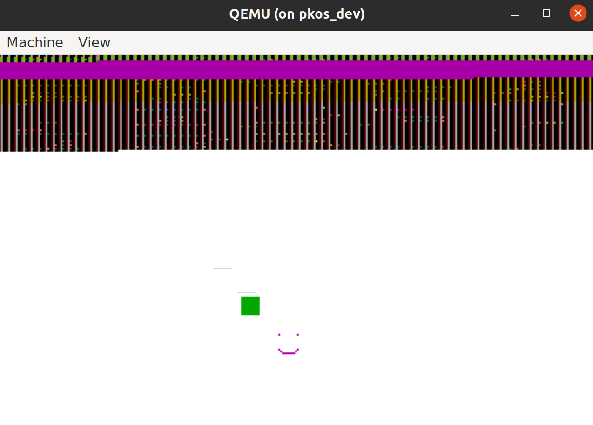
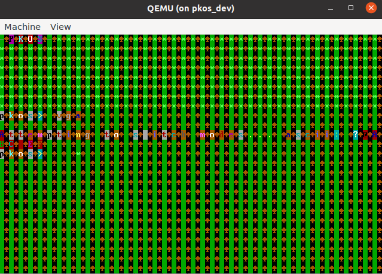

# OS22: The VGA Rabbit Hole

If you've been watching for the past few days, you'd notice that we've been grinding on VGA. Thankfully, it's not just me - this stuff is tough! In fact, OSDev wiki notes that, back in the day, knowing your way around VGA was enough to establish "quite a reputation" [^1].

Thankfully, with the help of people who joined the stream, we were able to get to the point where we can draw on *most* of the screen using memory-mapped I/O, and can escape graphics mode by hitting escape without ruining the text-mode graphics.

At the end, I threw in a quick rectangle animation just for fun (which cannot be interrupted).

See issue [#2](https://gitlab.com/pagekey/apps/pkos/pkos/-/issues/2) and MR [!2](https://gitlab.com/pagekey/apps/pkos/pkos/-/merge_requests/2) on GitLab for the code discussed in this post.

## Contents

1. [Motviation](#motivation)

   1. [How It Looked in OS15](#how-it-looked-in-os15)

   1. [Before](#how-its-going-now)

   1. [After](#how-its-going-now)

1. [Overview of VGA Registers](#overview-of-vga-registers)

   1. [Getting and Settings Values](#getting-and-settings-values)

      1. [Address and Data Registers](#address-and-data-registers)

      1. [I/O Select Bit (Mono/Color)](#io-select-bit-monocolor)

1. [Lessons Learned](#lessons-learned)

   1. [Not a State Machine](#not-a-state-machine)

   1. [Text Mode Attribute Byte](#text-mode-attribute-byte)

   1. [VGA Font Basics](#vga-font-basics)

   1. [Memcpy Woes - Jon's Address Breakthrough](#memcpy-woes---jons-address-breakthrough)

1. [The "Fix" - Beating Around the Bush](#the-fix---beating-around-the-bush)

1. [Next Steps](#next-steps)

   1. [Brute Forcing the Font Back](#brute-forcing-the-font-back)

   1. [VESA: More modern, better docs?](#vesa-more-modern-better-docs)

   1. [Other Projects, eventually Filesystem](#other-projects-eventually-filesystem)

## Motivation

In OS15, we were able to get the screen drawing working, but unable to get back into text mode. Afterward, the code was changed to allow exiting back to text mode, but the actual VGA mode looked terrible and did not seem to support normal drawing. The goal of this post was to fix that.

### How It Looked in OS15

This is what we're going for - just a canvas that you can draw pixels on.

Here's a [link](https://gitlab.com/pagekey/apps/pkos/pkos/-/blob/aec21a2e2b9b481a6883ce0843a7c1bd77e537b9/src/vga/vga.c#L9) to the VGA register values used in the working implementation.

### Before

I ended up changing the main branch at some point to allow you to get back into text mode without brekaing anything when you hit ESC. Unfortunately, this completely scrambled out drawings:

Thanks to Dominik Szasz on Discord for pointing this out.

### After

After much effort, we got to the point where you can switch back and forth and do some custom drawing. There's one problem, though:

The vertically striped areas of the screen must be left alone, or the font will be corrupted when you switch back to text mode. Everything else can be freely drawn upon with no negative effects.

Here's a bonus, a fun pic from along the way when some values got set incorrectly:

## Overview of VGA Registers

There are several groups of VGA registers, each representing a separate subsystem (once a separate chip, but usually all-in-one for modern cards). The groups include External/General, Sequencer, Attribute Controller (AC), Graphics Controller (GC), and Cathode Ray Tube Controller (CRTC) registers. While each group has its own idiosyncracies, the technique for getting and setting the values of these registers is mostly the same across the board.

### Getting and Settings Values

(TODO - diagram of getting/setting address/data reg)

VGA introduces the concept of separate registers for address and data. Since VGA has a ton of registers and I/O address space is at a premium, this approach lets you access dozens of registers using only a few I/O addresses. Here's how it works.

#### I/O Select Bit (Mono/Color)

(TODO - diagram)

A fun little detail of some of the registers was that the I/O address changed based on whether the system was in monochrome or color mode. You can detect which mode the system is in using a bit in the External/General registers.

My solution to this was to check this bit and conditionally use either the MONO or COLOR address constant.

#### AC Register

TODO - add to table of contents, figure out which one you had to read first before writing to???

## Lessons Learned

I learned a lot of lessons from trying to make this happen - the main one is that VGA is difficult and usually doesn't act how you'd think it would!

### Not a State Machine

First, VGA is not a state machine. Intuitively, it would make sense that if you read every single register and save the values, then the graphics card would behave the same when you re-write those values back to all the registers, right?

It turns out that this assumption is wrong. I'm not sure exactly what happens, but at some point, writing to one register affects the values of others. I think that even the order you write the registers in may matter, too.

#### A Working Order

TODO - add to table of contents

Through trial, error, and reading other people's code, I found that the following procedure works fairly well for entering graphics mode without destroying everything in text mode:

1. TODO - sequencer regs, etc.

1. TODO

- GC: Started here - convert existing VGA code to use our drivers
- AC: Very similar to GC but has palette

- Ext/Gen:
  - Had to do before CRTC b/c CRTC reg #'s dependent on this one
  - First exposure to conditional register #'s
- CRTC: See EXT, needed an input bit from it to tell mono vs color
- SEQ: Short, similar to GC approach

### Text Mode Attribute Byte

Another blatant error in the code was forgetting to set the color attribute byte when printing characters to the screen. The result was that when clearing the screen in graphics mode, all color bytes get set to 0, which makes the font black text on a black background when you return to text mode. This was a cause of great confusion until someone asked about how text colors work and I revisited that part of the code - so thank you to Brigita Yantie for pointing it out!

### VGA Font Basics

While the details are still a mystery, I am aware of the basics of VGA fonts:

- Each character seems to be represented by 128 bits, or 16 bytes
- The characters are displayed on the screen as 8x16 pixels, so each `0` represents background color and each `1` represents foreground color.
- Overwriting VGA characters in memory seems to mess everything up.

### Memcpy Woes - Jon's Address Breakthrough

I spent a lot of time trying different ways of copying memory to back up the current state of the text-mode video memory. I have a working `memcpy` function that relies on the x86 `movsb` instruction. It seemed to work, but backing up the video memory wasn't working as expected.

Instead, I wrote a for loop to copy each byte individually - this still did not work.

Thankfully, Jon Strong was on the stream, and he recommended that I change the address to which I was backing up the data. I initially chose what I thought was a very high address, unlikely to be used by anything else: `0x10b8000`. I also tried `0x1b8000`. However, it wasn't until I used Jon's suggestion of `0x1b800` as the backup address that things started to behave fairly normally.

## The "Fix" - Beating Around the Bush

Once the memory backup/restore was working fairly well, I started drawing on different parts of the screen and switching back to text mode to see what went wrong. Clearing the entire screen always corrupted all of the fonts, so that text mode was nothing more than a black screen. However, clearing just a quarter or half of the screen resulted in some characters being blanked out, but others remaining available.

I was able to find where the characters are mapped in VGA memory and modify them directly.

I was also able to modify *all* the memory around these characters with no issues when returning to text mode.

But for some reason that defies explanation, any changes I made to these font memory locations could not be undone by simply writing the old values back to that area.

So for now, you can use about 80% of the screen to draw whatever you want, but you're stuck with a colorful stripe where the fonts live - change this, and you'll have a hard time returning to text mode.

## Next Steps

This VGA exploration really did a number on me - I'm tired of looking into this! That being said, there are a few things left to try, keeping in mind the ultimate goal of having an easy-to-use, functional PKOS canvas that doesn't mess up text mode.

### Brute Forcing the Font Back

Something is going wrong when modifying the address change for the fonts, but what? The only way I can think to debug is to start with one character and go from there. If I modify the `'A'` character in VGA mode, but then write back the exact value for an `'A'`, what happens?

### VESA: More modern, better docs?

Jon Strong recommended looking into VESA, which, while less widely-supported than VGA, has more modern docs and is supposedly much easier to use.

### Other Projects, eventually Filesystem

I need to take a break from PKOS after this and work on [Boom Languages CE](https://gitlab.com/pagekey/apps/boom/boom-ce). Once that's up and running, it will probably make sense to plan a roadmap for PKOS. People seem to have a lot of enthusiasm for this project, so if I can break things up in a way that others can contribute, too, we could make a lot of progress in a short amount of time!

I think the main priority is being able to interact with hard drives for mass storage. I don't even think a filesystem is necessary, just some kind of persistent storage would be a game-changer. This would open the door to storing programs and compiling them on PKOS, which could eventually lead to writing PKOS code **on PKOS**!

## Reference

Most of the reference material can be found in the notes folder of this blog post on GitLab. Other sources are linked directly in the relevant source code.

### Related PageKey Streams

I started livestreaming PageKey videos recently, as an experiment, and it seems to work well! Here are the livestreams that led to the progress described in this video:

- [Custom OS Dust-Off (PKOS!) - Stream 7](https://youtube.com/live/isS3ALwlpPo)
- [PKOS: Finishing up VGA Improvements - Stream 8](https://youtube.com/live/Gd9qGMlqYfc)
- [Pesky VGA... (PKOS) - Stream 9](https://youtube.com/live/WKel56TQTpY)
- [VGA Fonts, are they the key? - Stream 10](https://youtube.com/live/e69PKM1xR1o)
- [More VGA (and Fonts) - Stream 11](https://youtube.com/live/bcMMHG8sw60)
- [VGA End Game - Stream 12](https://youtube.com/live/FSSLmEiymKQ)

[^1]: https://wiki.osdev.org/VGA_Hardware#Overview
